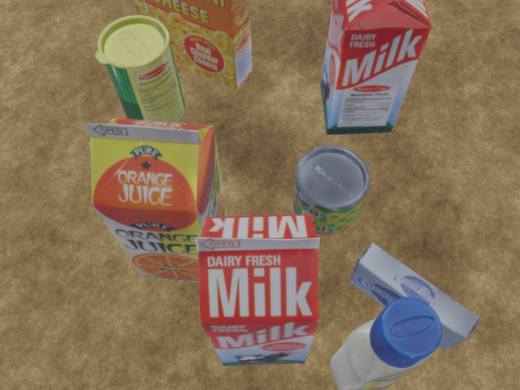
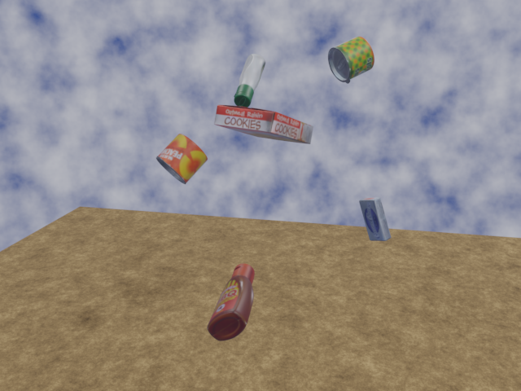

# BOP Dataset Generator

This tool is designed to generate datasets in the BOP format. It can produce RGB images, depth images, and ground truth annotations for object poses. The tool has been tested with objects from the HOPE and YCB datasets. Note that some parts of the dataset specified in the BOP format are not generated directly with this tool. The official [bop_toolkit](https://github.com/thodan/bop_toolkit) can be used to provide those missing parts.

## Features

- **Semi-Manual Tool**: Modify parts of the scene using the Blender GUI.
- **Scene Generation**: Create scenes with random object arrangements considering possible collisions.
- **Camera Movements**: Introduce random camera movements.
- **Object Movements**: Allow random object movements (collisions not considered).

## Requirements

- **Blender Version**: Developed and tested in Blender 3.6.3. Compatibility with other versions is not guaranteed.

## Usage

### Setup

1. Open the `Generator_manual.blend` file in Blender.
2. Import your 3D objects using the `import_ply.py` script available within the `Generator_manual.blend` file.
3. Edit the absolute paths and parameters in the scripts to fit your requirements.

### Dataset Generation

- **Static Dataset**: Run `main.py` to generate a static dataset.
- **Dynamic Dataset**: Run `main_dynamic.py` to generate a dynamic dataset.

### Sampling New Trajectories

Use the `sample_trajectories.py` script to sample new trajectories.

note that some of the parts of the dataset specified in the BOP format are not generated directly with this tool and the oficial bop_toolkit https://github.com/thodan/bop_toolkit can be used to provide those.

## Example Images

### Static Scene

### Dynamic Scene

---
